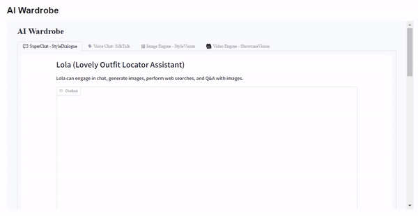
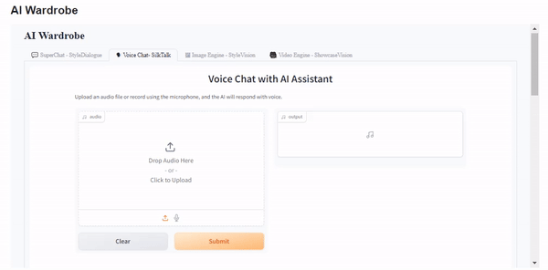

## AIFA-Ai-Fashion-Assistant
A Gen AI-powered platform that understands and interprets detailed user requests, offering personalized product recommendations, and enabling custom clothing design through easy-to-use tools, ensuring users find exactly what they’re looking for or create it themselves.

|  Image Engine | Super Chat  |
| ----------------------- | ----------------------- |
|   |  | 

|  Voice Chat | Video Engine  |
| ----------------------- | ----------------------- |
|  |  |

Acknowledgement: KingNish@Huggingface, huggingface spaces.
